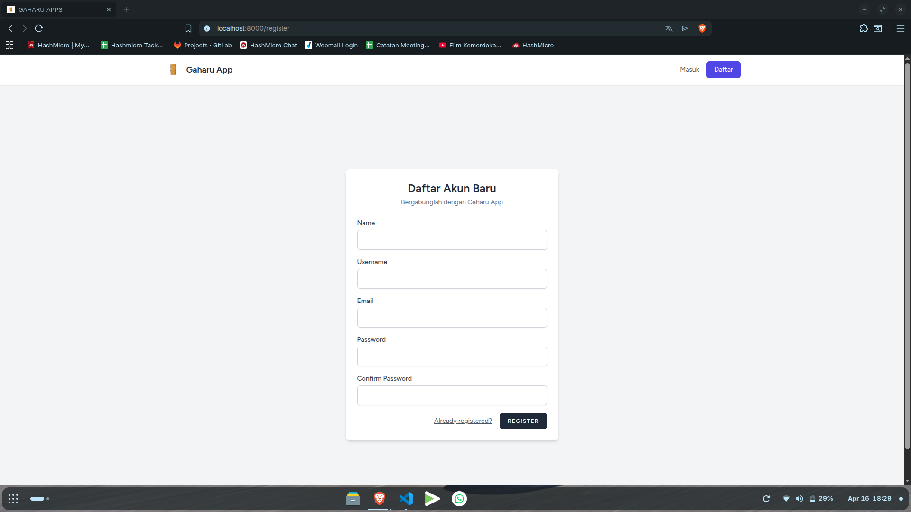
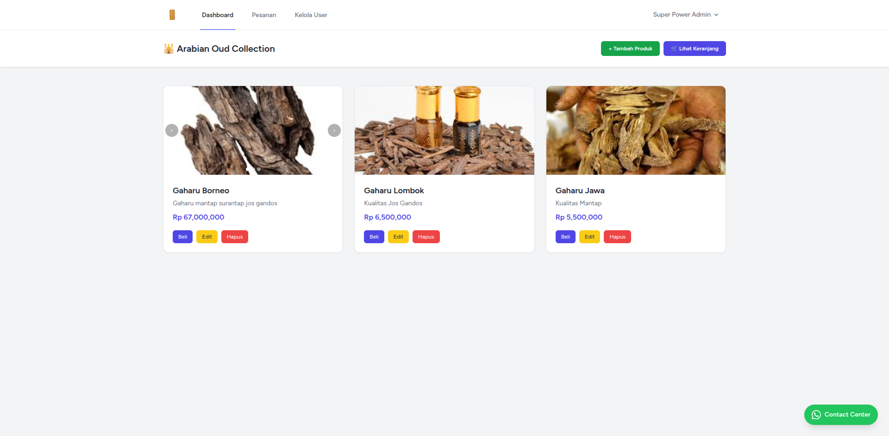
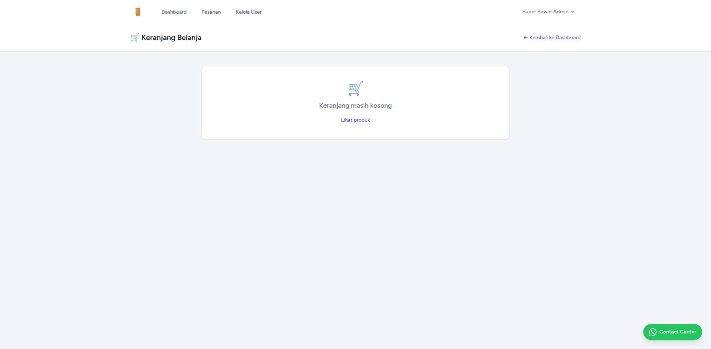
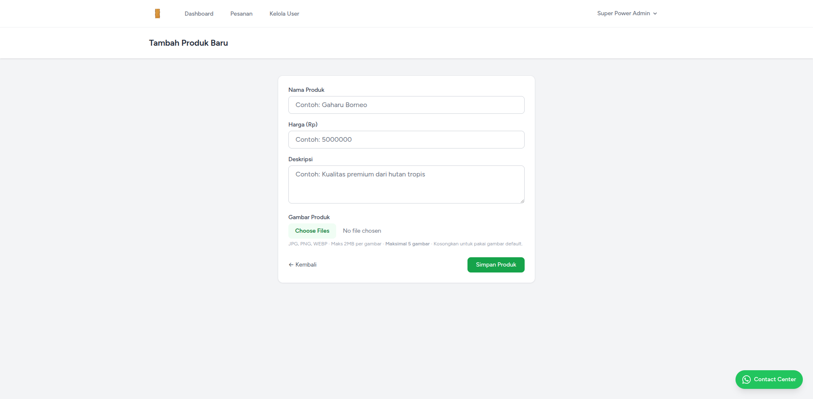
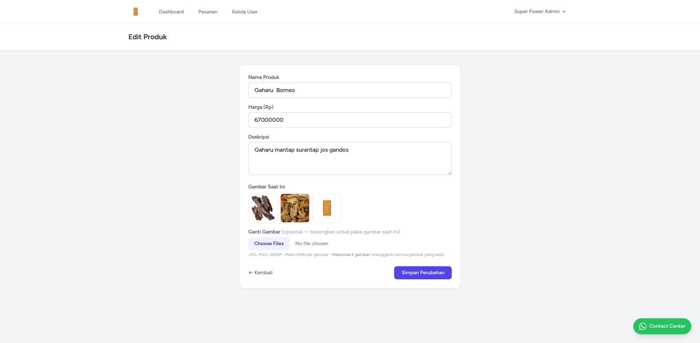
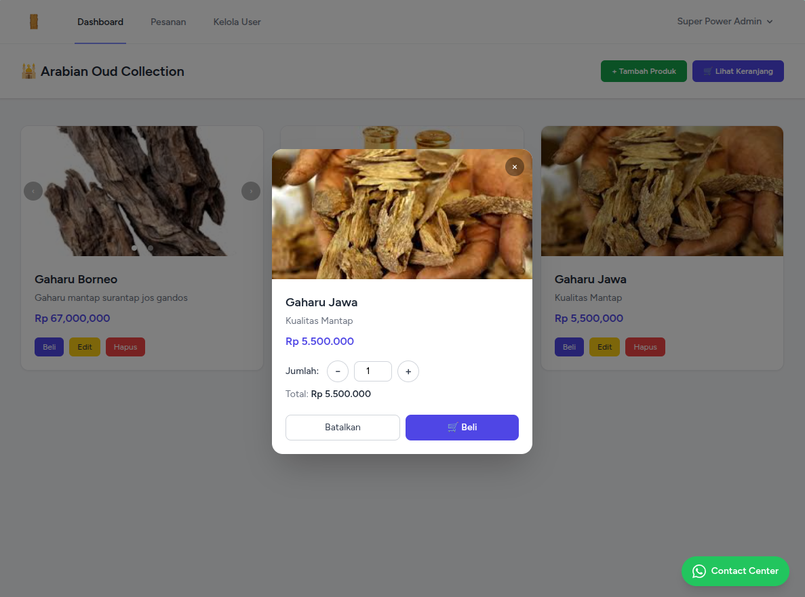
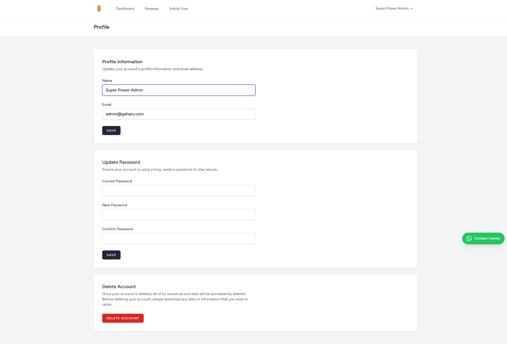
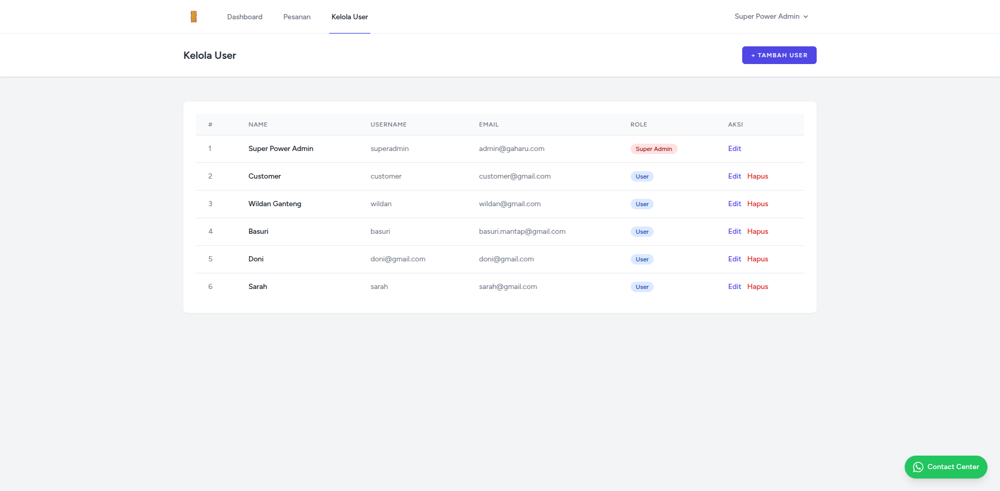
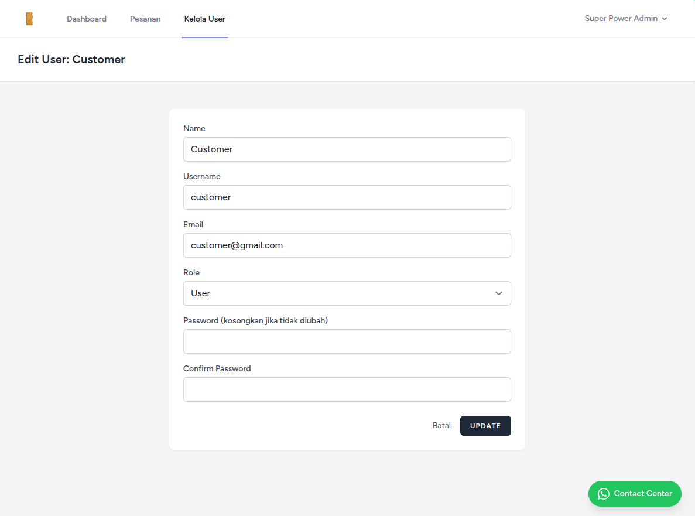

# Dokumentasi Halaman Web & Route

Berikut adalah dokumentasi setiap halaman web beserta route pada aplikasi Gaharu App. Setiap halaman dilengkapi dengan deskripsi, URL, method, dan gambar (screenshot) jika tersedia.

---

## 1. Registrasi

- **URL:** `/register`
- **Method:** GET, POST
- **Deskripsi:** Halaman untuk pendaftaran user baru ke aplikasi.
- **Screenshot:**
	

---

## 2. Login

- **URL:** `/login`
- **Method:** GET, POST
- **Deskripsi:** Halaman login untuk masuk ke aplikasi.
- **Screenshot:**
	

---

## 3. Dashboard

- **URL:** `/dashboard`
- **Method:** GET
- **Deskripsi:** Halaman utama setelah login, menampilkan daftar produk dan jumlah item di keranjang.
- **Screenshot:**
	

---

## 4. Keranjang

- **URL:** `/cart`
- **Method:** GET
- **Deskripsi:** Menampilkan isi keranjang belanja user.
- **Screenshot:**
	

---

## 5. Tambah Produk

- **URL:** `/produk/tambah`
- **Method:** GET, POST
- **Deskripsi:** Halaman untuk menambah produk baru (khusus super admin).
- **Screenshot:**
	

---

## 6. Edit Produk

- **URL:** `/edit/{id}`
- **Method:** GET
- **Deskripsi:** Halaman untuk mengedit produk (khusus super admin).
- **Screenshot:**
	

---

## 7. Beli

- **Deskripsi:** Munculdialog untuk konfirmasi jumlah produk yang akan dibeli.
- **Screenshot:**
	

---

## 8. Profil

- **URL:** `/profile`
- **Method:** GET, PATCH, DELETE
- **Deskripsi:** Halaman pengaturan profil user.
- **Screenshot:**
	

---

## 9. Manajemen User (Admin)

- **URL:** `/admin/users`
- **Method:** GET, POST, PUT, DELETE
- **Deskripsi:** Halaman manajemen user (khusus super admin).
- **Screenshot:**
	

---

## 9a. Edit User (Admin)

- **URL:** `/admin/users/{user}/edit`
- **Method:** GET
- **Deskripsi:** Halaman untuk mengedit data user (khusus super admin). Admin dapat mengubah nama, email, role, dan data lain user.
- **Screenshot:**
  

---

## 10. Konfirmasi Hapus Data

- **Produk:**
	- Pesan konfirmasi: `Hapus produk ini?`
- **User:**
	- Pesan konfirmasi: `Hapus user ini?` *(asumsi pesan serupa, sesuaikan jika berbeda di aplikasi)*
- **Pesanan:**
	- Pesan konfirmasi: `Hapus pesanan ini?` *(asumsi pesan serupa, sesuaikan jika berbeda di aplikasi)*

---

## 11. Dashboard (User Customer)

- **URL:** `/dashboard`
- **Method:** GET
- **Deskripsi:** Tampilan dashboard untuk user biasa (bukan Super Admin). Fitur yang tersedia lebih terbatas, hanya bisa melihat produk, menambah ke keranjang, dan melakukan pemesanan. Tidak ada menu tambah/edit/hapus produk, manajemen user, atau fitur admin lainnya.
- **Screenshot:**
	

---

## 12. Fitur User Customer

- **Keranjang:**
	- User dapat menambah produk ke keranjang dan melihat isi keranjang.
- **Pemesanan:**
	- User dapat melakukan pemesanan produk dari keranjang.
- **Profil:**
	- User dapat mengakses dan mengedit profil sendiri.
- **Tidak Ada Akses:**
	- Menu tambah produk, edit produk, hapus produk, dan manajemen user tidak tersedia untuk user biasa.

---

> Catatan: Pesan konfirmasi muncul sebagai dialog browser (bukan modal HTML), sehingga tidak dapat diambil screenshot-nya secara otomatis.

